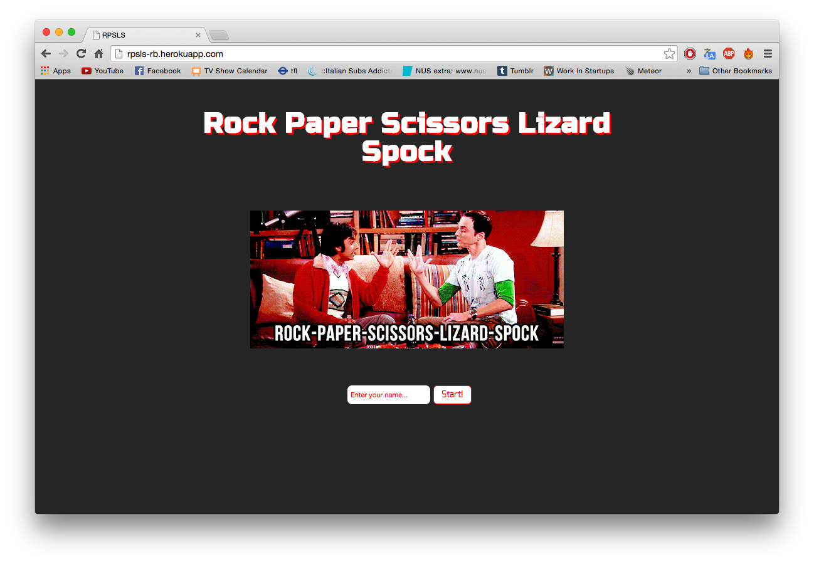
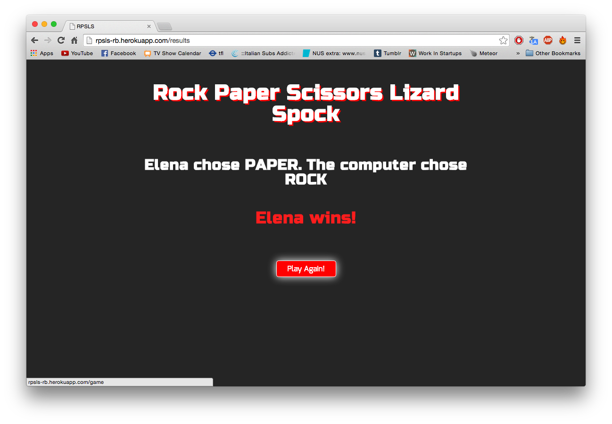

[](https://codeclimate.com/repos/54918f8e69568022ce0007c9/feed)

ROCK/PAPER/SCISSORS/LIZARD/SPOCK
================================
The challange for week 3 was to create 'Rock, Paper, Scissors, Lizard, Spock' for the browser. It's built using Sinatra and Ruby. Testing was done with RSpec and Cucumber.





On Heroku:
----------
https://rpsls-rb.herokuapp.com/game

Technologies:
------------
- Ruby
- Sinatra
- CSS
- HTML
- RSpec
- Cucumber
- Capybara
- Git

How to use:
-----------

Clone the directory:
```shell
$ git clone https://github.com/elenagarrone/RPSLS.git
```
Change into it:
```shell
$ cd RPSLS
```
Install the gems:
```shell
$ bundle install
```
Try it on localhost:
```shell
$ rackup
#then on the browser go to:
localhost:9292
```

How to test it:
--------------
From inside the directory run:
```shell
$ rspec
```
and:
```shell
$ cucumber
```
